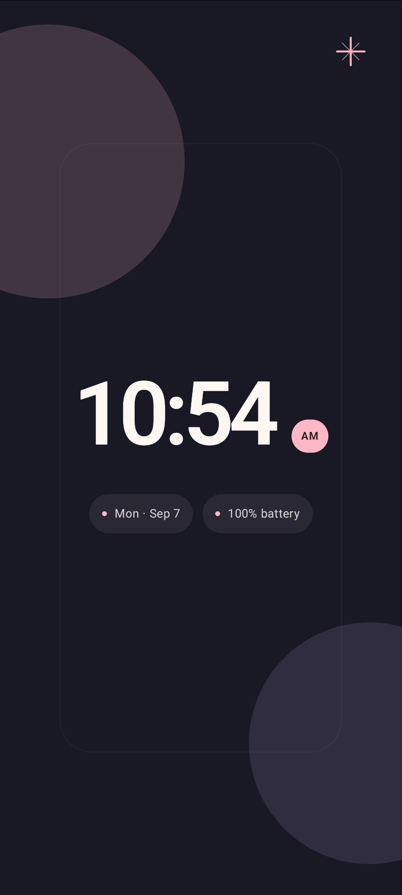
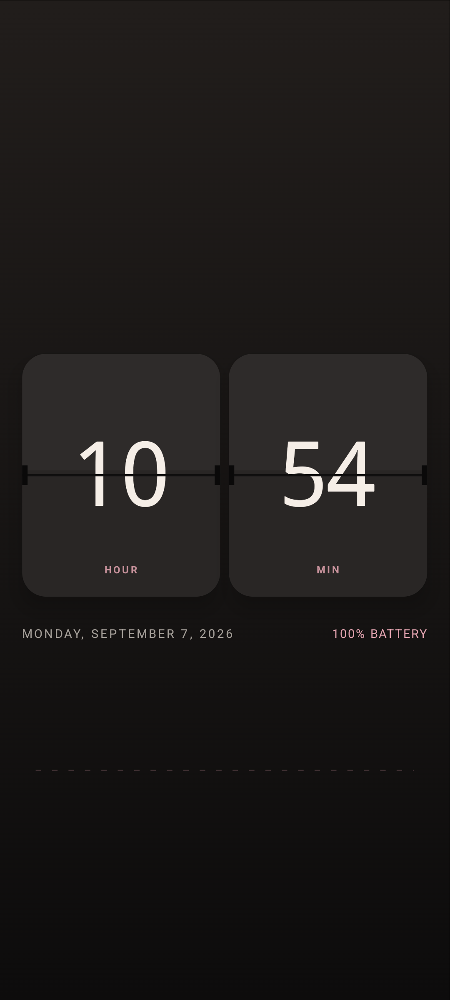
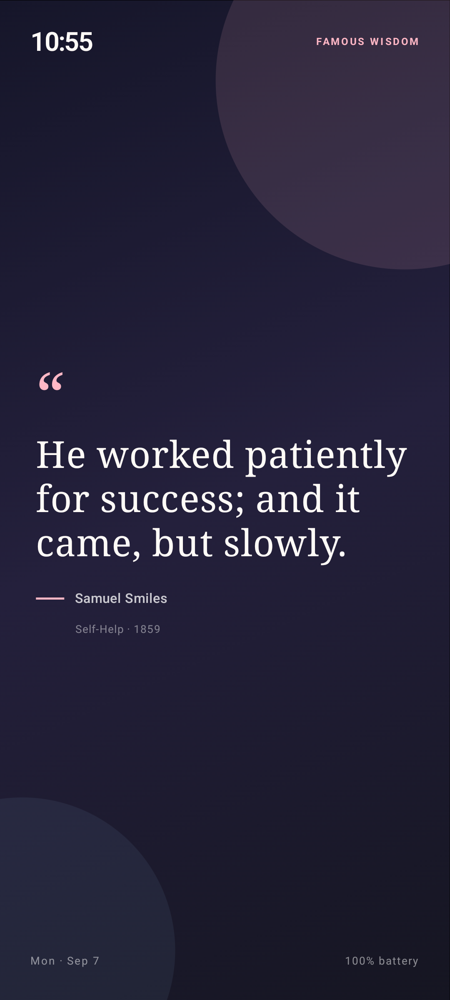
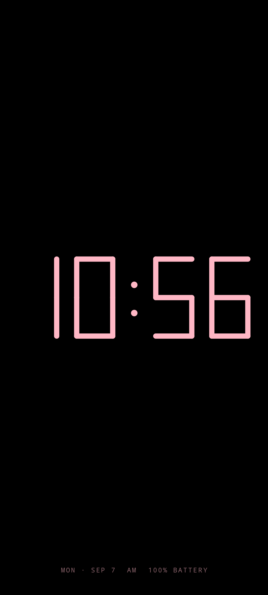
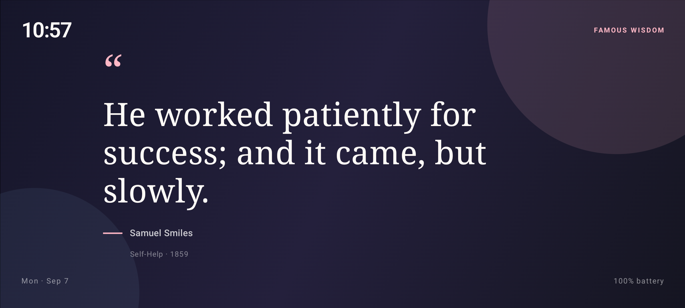

# Stilltime

Stilltime turns an Android phone or tablet into a quiet bedside or desk clock. It is an offline-first, privacy-friendly app with seven hand-built faces, an Android system screensaver, OLED-conscious options, and a sourced Muse feed with more than 200 entries.

## Highlights

- Seven responsive faces: Pebble, Flip, Editorial, Orbit, Solar, Muse, and true-black Noir.
- Muse rotates between public-domain wisdom, source-backed life notes, and short attributed anime moments every 15 minutes.
- Every Muse card carries an author or organization, work/source title, and a tappable source URL.
- System, 12-hour, and 24-hour time; optional seconds, date, battery, and charging state.
- Five accent palettes and four brightness modes.
- Built-in `DreamService`, so Stilltime can be selected under Android's Screen saver settings.
- No internet permission, analytics, ads, account, background sync, wake lock, alarm, or foreground service.
- Android 8.0 (API 26) and newer.

## A few faces

<p align="center">
  
  
  
  
</p>

<p align="center">
  
</p>

## Power strategy

Always-on screens are never free: the display itself usually dominates. Stilltime minimizes avoidable app work and lets the user choose the visual/power trade-off.

- Seconds are off by default. The clock sleeps until the next exact minute boundary instead of polling or drawing continuously.
- Updates stop when the Activity is not resumed. There are no perpetual animations.
- The optional keep-screen-on behavior is scoped to the visible Activity; no CPU wake lock is requested.
- The system screensaver path uses Android's supported `DreamService` lifecycle for charging/docked idle use.
- Noir uses a pure-black background and sparse segments. On OLED hardware this is the most energy-conscious face; on LCD, brightness matters more than black pixels.
- Night brightness is available for bedside use, while System remains the safe default across unknown hardware.
- A tiny deterministic 3 dp drift changes every two minutes to spread static content across neighboring pixels.
- The entire Muse library ships locally and is cached after its first parse, so rotation performs no network work.

For real measurements, compare faces and brightness modes on the target device using Android Studio's Power Profiler. Emulator tests cannot establish battery life.

## Build and run

Requirements: Android Studio with JDK 17 or newer and Android SDK 37.

```bash
./gradlew testDebugUnitTest lintDebug assembleDebug
```

Install the debug build on a connected device:

```bash
adb install -r app/build/outputs/apk/debug/app-debug.apk
```

Open Stilltime once to choose a face. To use it while charging, tap the in-app **Screen saver settings** button and select **Stilltime** in Android settings. Availability and menu labels vary by manufacturer.

## Muse library

The tab-separated library lives at `app/src/main/res/raw/motivation.tsv` with this schema:

```text
category<TAB>text<TAB>attribution<TAB>source title<TAB>source URL
```

`WISDOM` contains short passages checked against public-domain primary texts. `LIFE_FACT` contains original plain-language summaries linked to health or research sources. `ANIME` contains short attributed excerpts with provenance links; those underlying works remain copyrighted. Read [THIRD_PARTY_NOTICES.md](THIRD_PARTY_NOTICES.md) before redistribution, especially for a commercial or Play Store release.

Tests enforce a minimum of 200 complete, sourced, unique entries and a 20-word ceiling for quoted entries.

## Design and engineering research

The implementation decisions and benchmark survey are documented in [docs/RESEARCH.md](docs/RESEARCH.md). Key references include Android's guidance for [keeping a device awake](https://developer.android.com/develop/background-work/background-tasks/awake), the [`DreamService` API](https://developer.android.com/reference/android/service/dreams/DreamService), [Compose performance guidance](https://developer.android.com/develop/ui/compose/performance/bestpractices), AOSP's [clock burn-in guidance](https://android.googlesource.com/platform/frameworks/base/%2Bshow/android10-release/packages/SystemUI/docs/clock-plugins.md), and Android Studio's [Power Profiler](https://developer.android.com/studio/profile/power-profiler).

## License and privacy

Original source code is Apache-2.0 licensed. Content with separate rights is identified in [THIRD_PARTY_NOTICES.md](THIRD_PARTY_NOTICES.md). Stilltime processes no personal data and requests no network access; see [PRIVACY.md](PRIVACY.md).
