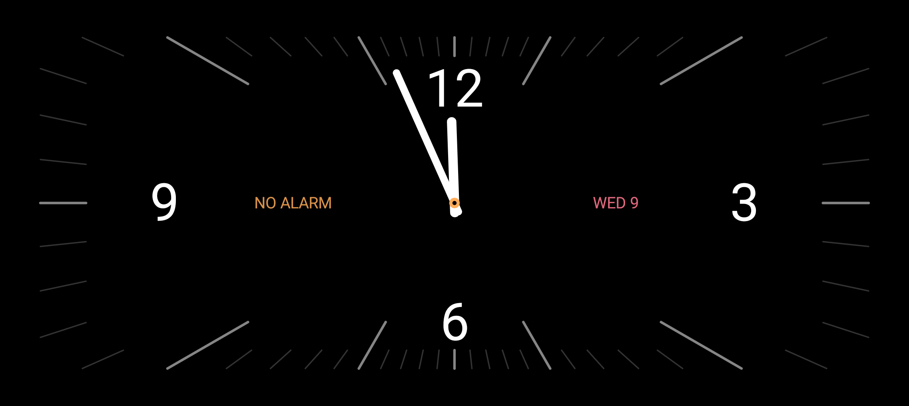
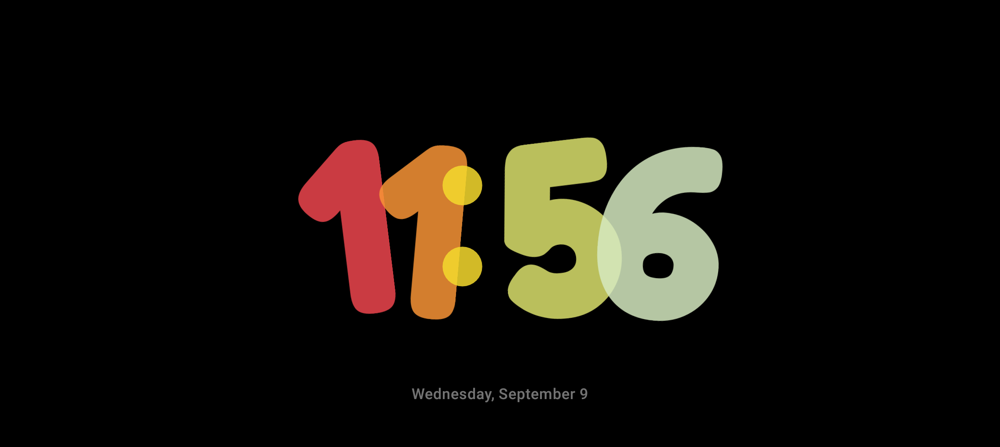
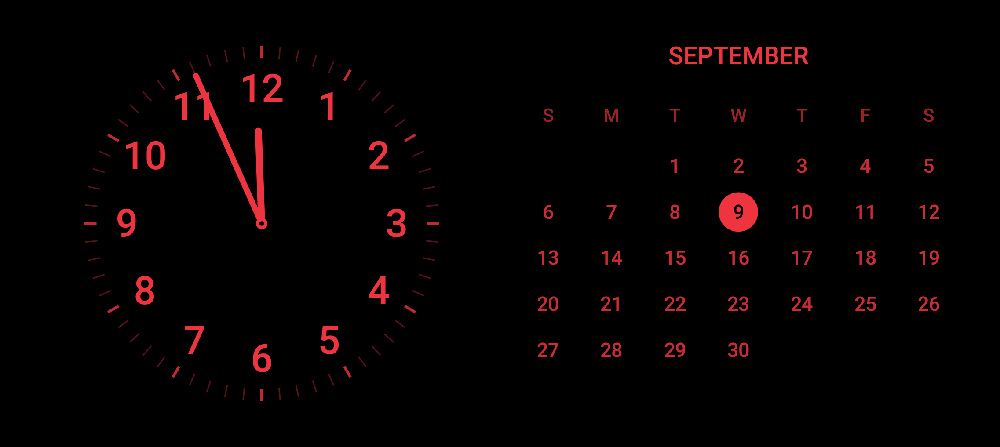
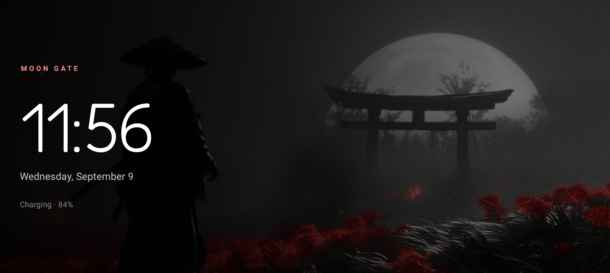
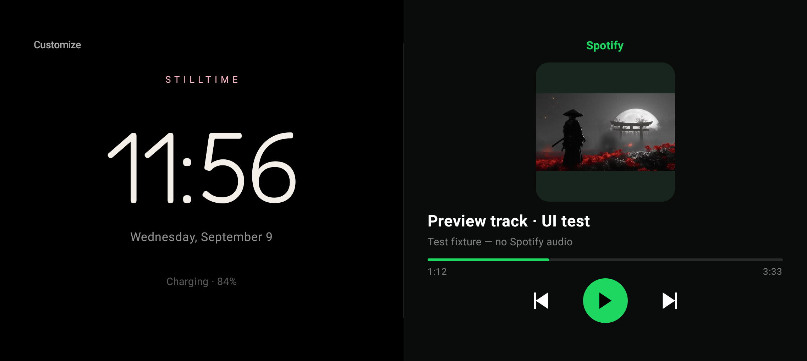
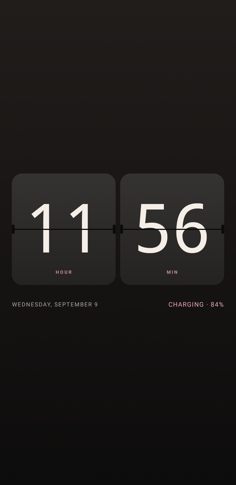

# Stilltime

Stilltime turns an Android phone or tablet into a quiet bedside or desk clock. Version 1.1 adds reference-inspired faces, eight local wallpapers, and an optional Spotify App Remote player to the original offline clock and sourced Muse feed.

## Highlights

- Thirteen faces: Pebble, Flip, Editorial, Orbit, Solar, Muse, Noir, Panorama, Redline, Night calendar, Chroma, Wallpapers, and Spotify.
- Polished adaptive customization panel with real static theme previews, selection indicators, grouped controls, and pinned Close/Done actions.
- Flip now has a two-stage, perspective split-flap animation with hinge shading and responsive numerals. It runs for 640 ms only when a value changes, stops when hidden, honors system animation scaling, and has an off switch.
- Reference-inspired wide analog clocks in white or red, a real month calendar, and overlapping multicolor rounded digits.
- Eight supplied wallpapers, three compositions (Cinema, Gallery, Poster), three dimming levels, and three typography choices.
- Spotify landscape mode: equal left/right clock and player panels, album art, title/artist marquee, previous/play/pause/next, and elapsed/total track progress. Portrait falls back to a stacked layout.
- Muse rotates between public-domain wisdom, source-backed life notes, and short attributed anime moments every 15 minutes.
- Every Muse card carries an author or organization, work/source title, and a tappable source URL.
- System, 12-hour, and 24-hour time; optional seconds, date, battery, and charging state.
- Five accent palettes and four brightness modes.
- Built-in `DreamService`, so Stilltime can be selected under Android's Screen saver settings.
- No analytics, ads, background sync, wake lock, scheduled alarm, or foreground service. The optional Spotify integration adds internet permission; all other faces and the Muse corpus remain local.
- Android 8.0 (API 26) and newer.

## A few faces

<p align="center">
  
  
  
  
</p>

The Spotify screenshot below uses an explicitly labelled test fixture to validate layout and controls, not a live Spotify session.



<p align="center">
  
  
  
  
</p>

<p align="center">
  
</p>

## Power strategy

Always-on screens are never free: the display itself usually dominates. Stilltime minimizes avoidable app work and lets the user choose the visual/power trade-off.

- Seconds are off by default. The clock sleeps until the next exact minute boundary instead of polling or drawing continuously.
- Updates stop when the Activity is not resumed. There are no perpetual animations.
- Flip is event-driven, not a continuous sweep. Its preview tiles never animate; disabling seconds keeps it to minute-boundary transitions. Bright wallpapers and Spotify playback still consume more power than a static black face.
- The optional keep-screen-on behavior is scoped to the visible Activity; no CPU wake lock is requested.
- The system screensaver path uses Android's supported `DreamService` lifecycle for charging/docked idle use.
- Noir uses a pure-black background and sparse segments. On OLED hardware this is the most energy-conscious face; on LCD, brightness matters more than black pixels.
- Night brightness is available for bedside use, while System remains the safe default across unknown hardware.
- A tiny deterministic 3 dp drift changes every two minutes to spread static content across neighboring pixels.
- The entire Muse library ships locally and is cached after its first parse, so rotation performs no network work.
- Wallpaper JPEGs total about 350 KB; their native resolution is retained in `drawable-nodpi`. They are decoded when composed, not per clock tick. Dimming uses static overlays rather than bitmap filters, blur, or animation.
- Spotify connects only while its theme is visible in a started Activity or attached screensaver. Subscriptions and the connection are cancelled on exit; stale connection/art callbacks are discarded. Switching themes never pauses the user's music.
- Playback position is interpolated locally once per second only during active playback. No polling of Spotify's player endpoint is used. Long metadata scrolls at most three times per track and can be disabled.

For real measurements, compare faces and brightness modes on the target device using Android Studio's Power Profiler. Emulator tests cannot establish battery life.

## Build and run

Requirements: Android Studio with JDK 17 or newer and Android SDK 37.

```bash
./gradlew testDebugUnitTest lintDebug assembleDebug
```

Install the debug build on a connected device:

```bash
adb install -r app/build/outputs/apk/debug/app-debug.apk
```

Open Stilltime once to choose a face. To use it while charging, tap the in-app **Screen saver settings** button and select **Stilltime** in Android settings. Availability and menu labels vary by manufacturer.

## Spotify setup

The owner's Stilltime Spotify developer app is registered, and its public Client ID and redirect URI are in `gradle.properties`. No client secret or access token is included. Install Spotify on the same Android device, sign in, select the Spotify face in Stilltime, and tap **Connect** to authorize playback control. Stilltime never starts a track automatically.

The supplied preview APK is minified and resource-shrunk, with debugging disabled, but signed with the same development certificate as the original APK so it can update that installation. It is not a Play Store signing configuration. New signing keys or another developer account require matching Spotify registration. See [docs/SPOTIFY.md](docs/SPOTIFY.md) for exact setup, certificate details, failure states, and test limits.

## Muse library

The tab-separated library lives at `app/src/main/res/raw/motivation.tsv` with this schema:

```text
category<TAB>text<TAB>attribution<TAB>source title<TAB>source URL
```

`WISDOM` contains short passages checked against public-domain primary texts. `LIFE_FACT` contains original plain-language summaries linked to health or research sources. `ANIME` contains short attributed excerpts with provenance links; those underlying works remain copyrighted. Read [THIRD_PARTY_NOTICES.md](THIRD_PARTY_NOTICES.md) before redistribution, especially for a commercial or Play Store release.

Tests enforce a minimum of 200 complete, sourced, unique entries and a 20-word ceiling for quoted entries.

## Design and engineering research

The implementation decisions and benchmark survey are documented in [docs/RESEARCH.md](docs/RESEARCH.md). Key references include Android's guidance for [keeping a device awake](https://developer.android.com/develop/background-work/background-tasks/awake), the [`DreamService` API](https://developer.android.com/reference/android/service/dreams/DreamService), [Compose performance guidance](https://developer.android.com/develop/ui/compose/performance/bestpractices), AOSP's [clock burn-in guidance](https://android.googlesource.com/platform/frameworks/base/%2Bshow/android10-release/packages/SystemUI/docs/clock-plugins.md), and Android Studio's [Power Profiler](https://developer.android.com/studio/profile/power-profiler).

## License and privacy

Original source code is Apache-2.0 licensed. Supplied wallpapers, Muse content, fonts, and SDK notices are identified in [THIRD_PARTY_NOTICES.md](THIRD_PARTY_NOTICES.md). Spotify metadata is transient, and the app has no analytics; see [PRIVACY.md](PRIVACY.md).
